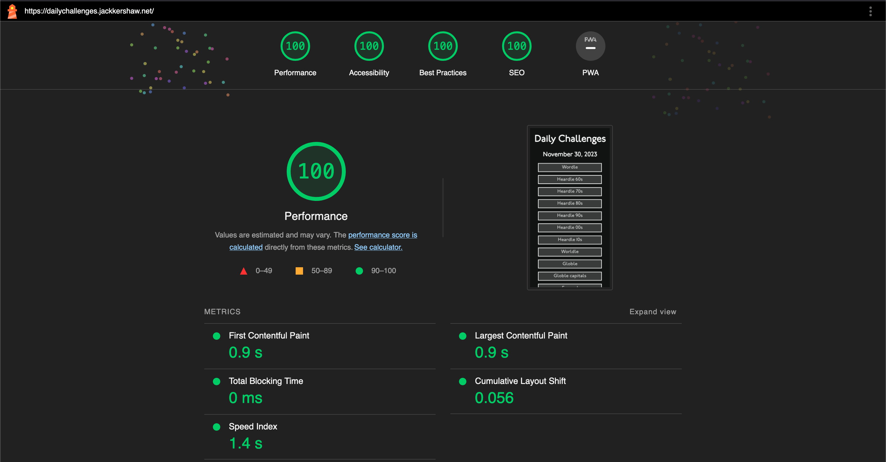

# daily-challenges

Simple website to link to all the daily challenges (like Wordle etc.)

## Changelog

After making the initial design I decided to make some changes to the site.

- Changed the colour scheme to Wordle's based on user feedback.
- Ran Google Lighthouse on the site to check accessibility. Mostly positive, but it instructed me to:
  - Add a meta description
  - Use the font display option to swap font on page load.
- Media query for desktop view. I originally designed for mobile which made things too big for desktop. Bizarrely I used vw for the font sizes so I changed that too.
- Added a reset button.
- Used local storage to save button click state so page reload doesn't change it and reset button colour when new day.
- Edited the CSS to make it look better on different screen sizes.
- Added view on Github button
- Ran Google Lighthouse to check the accessibility of the site and got a report with 100 for all categories. 
- Deleted some challenges from the website to streamline it for new users. Added the excellent Hexcodle, a useful tool for developers learning about hexcodes and base-16.
- Added landmarks to improve accessibility.
- Added an intro screen, like on [Wordle](https://www.nytimes.com/games/wordle/index.html) to explain what the website is about.
- Improved desktop css to show all the content.

## To do later:

- Store whether
- Button so people can add their own
